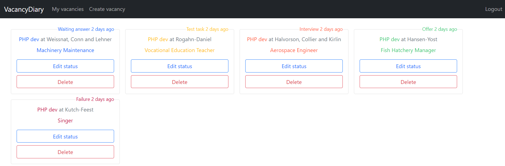

#VacancyDiary
This is application is provided to make tracking of sent
vacancies much easier. With this app you can create new vacancies
where you already sent your CV, change status of it and delete
vacancies that you don't need anymore.
##Statuses
It is available some statuses that will help you to better understand
at what stage your vacancy is:
- Waiting answer;
- Test task;
- Interview;
- Offer;
- Failure.

For each status there are different colors to make you page with
vacancies more pretty and better to understand:

In the future it will be added a opportunity to change status
name and color.
##Users
Vacancies is assigned to user, so to see your vacancies you created
before firstly you need to authorise with email and password.

